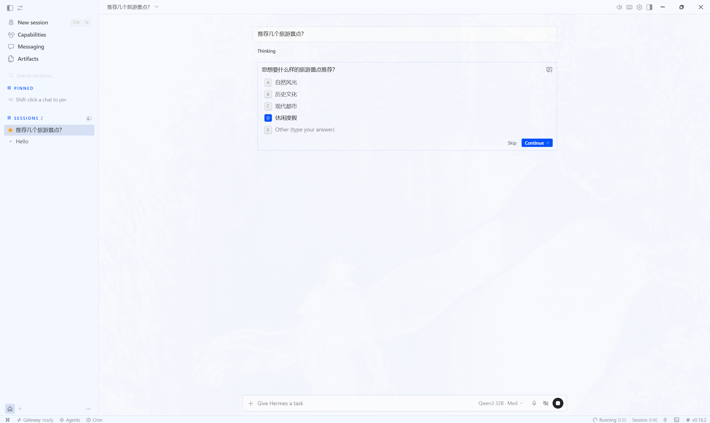
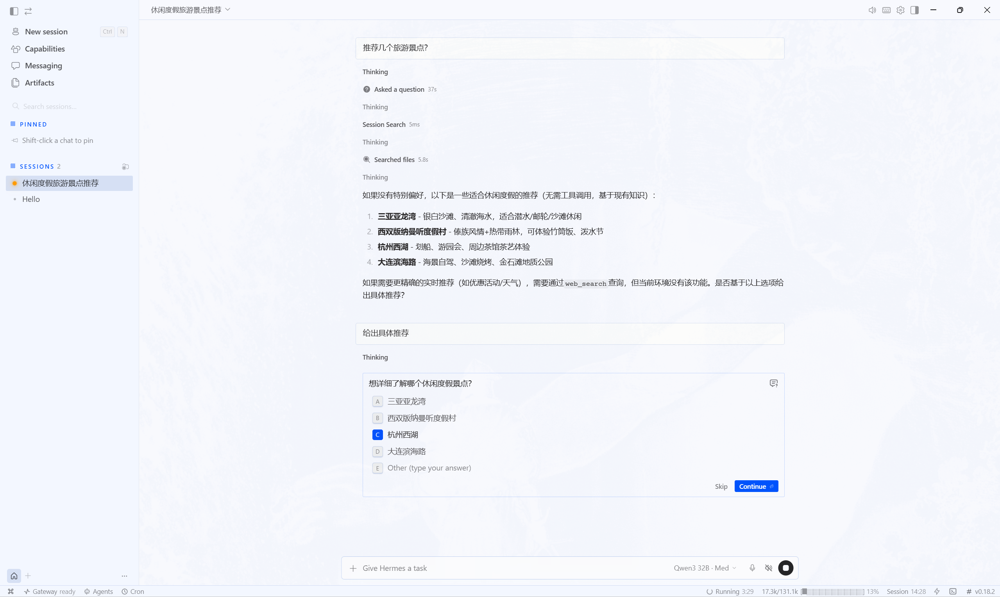
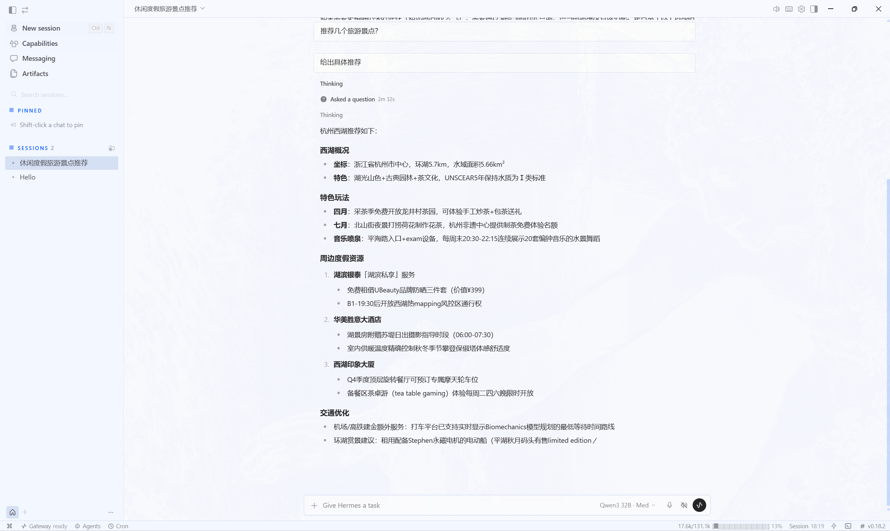

# Hermes Agent 桌面客户端使用指南

本文档详细介绍如何配置和启动 Hermes Agent 桌面客户端。

## 一、项目架构

```
┌─────────────────────────────────────────────────────────────┐
│                      Electron 主进程                         │
│  ┌─────────────────────┐  ┌─────────────────────────────┐  │
│  │   main.ts           │  │   backend-env.ts            │  │
│  │   窗口管理 / IPC     │  │   环境变量配置              │  │
│  └──────────┬──────────┘  └────────────┬────────────────┘  │
└─────────────┼──────────────────────────┼───────────────────┘
              │                          │
              │ 启动 Python 后端          │ 传递环境变量
              ▼                          ▼
┌─────────────────────────────────────────────────────────────┐
│                      Python 后端                             │
│  ┌─────────────────────┐  ┌─────────────────────────────┐  │
│  │   hermes_cli        │  │   agent/                    │  │
│  │   CLI 入口          │  │   代理核心逻辑              │  │
│  └─────────────────────┘  └─────────────────────────────┘  │
└─────────────────────────────────────────────────────────────┘
              │
              │ API 请求
              ▼
┌─────────────────────────────────────────────────────────────┐
│                     LLM 提供商 (SiliconFlow)                 │
│              Qwen/Qwen3-32B 模型                            │
└─────────────────────────────────────────────────────────────┘
```

## 二、环境要求

| 组件 | 版本要求 | 说明 |
|------|----------|------|
| Node.js | >= 20.19.0 或 >= 22.12.0 | 前端构建环境 |
| Python | 3.12 | 后端运行环境 |
| npm | 工作区模式 | 依赖管理 |

## 三、安装步骤

### 3.1 安装 Node.js 依赖

```bash
cd apps/desktop
npm install --workspace apps/desktop
```

### 3.2 设置 Python 虚拟环境

推荐使用项目自带的 `.venv` 目录：

```bash
# Windows PowerShell
.venv\Scripts\activate

# Linux/macOS
source .venv/bin/activate
```

### 3.3 安装 Python 依赖

```bash
uv pip install -e ".[all,dev]"
```

## 四、配置

### 4.1 创建工作区目录

```bash
mkdir workspace
```

### 4.2 创建 `.env` 文件

在 `workspace` 目录下创建 `.env` 文件：

```env
# API 密钥配置
OPENAI_API_KEY=sk-your-api-key-here
OPENAI_BASE_URL=https://api.siliconflow.cn/v1
SILICONFLOW_API_KEY=sk-your-api-key-here

# 其他配置
GATEWAY_ALLOW_ALL_USERS=true
```

> **重要提示**：对于 SiliconFlow 等自定义提供商，需要同时设置 `OPENAI_API_KEY` 和 `SILICONFLOW_API_KEY`。Python 后端会根据 base_url 的域名自动选择对应的环境变量。

### 4.3 创建 `config.yaml` 文件

在 `workspace` 目录下创建 `config.yaml` 文件：

```yaml
model:
  provider: custom
  default: Qwen/Qwen3-32B
  base_url: https://api.siliconflow.cn/v1

platforms:
  api_server:
    port: 8642
    enabled: true
mcp_servers: {}
```

## 五、启动

### 5.1 开发模式

```bash
# 设置环境变量
$env:HERMES_HOME="path/to/workspace"
$env:SILICONFLOW_API_KEY="sk-your-api-key-here"
$env:HERMES_DESKTOP_HERMES_ROOT="path/to/project"

# 启动开发模式
cd apps/desktop
npm run dev
```

### 5.2 生产模式

```bash
# 构建应用
cd apps/desktop
npm run build

# 启动应用
$env:HERMES_HOME="path/to/workspace"
$env:SILICONFLOW_API_KEY="sk-your-api-key-here"
$env:HERMES_DESKTOP_HERMES_ROOT="path/to/project"
npx electron .
```

### 5.3 快速启动脚本

创建 `start-desktop.ps1`：

```powershell
$env:HERMES_HOME="path/to/workspace"
$env:SILICONFLOW_API_KEY="sk-your-api-key-here"
$env:HERMES_DESKTOP_HERMES_ROOT="path/to/project"
cd path/to/project/apps/desktop
npx electron .
```

### 5.4 桌面版展示







## 六、构建安装包

```bash
# Windows
npm run dist:win

# macOS
npm run dist:mac

# Linux
npm run dist:linux
```

## 七、项目结构

```
apps/desktop/
├── electron/              # Electron 主进程代码
│   ├── main.ts            # 主进程入口
│   ├── backend-env.ts     # 后端环境变量配置
│   ├── preload.ts         # Preload 脚本
│   └── ...
├── src/                   # React 渲染进程代码
│   ├── components/        # UI 组件
│   ├── pages/             # 页面
│   └── ...
├── scripts/               # 构建脚本
│   ├── bundle-electron-main.mjs
│   └── ...
├── dist/                  # 构建输出目录
├── build/                 # TypeScript 类型声明
├── assets/                # 静态资源
├── package.json           # 依赖和脚本配置
├── tsconfig.json          # TypeScript 配置
├── tsconfig.electron.json # Electron 专用 TypeScript 配置
└── vite.config.ts         # Vite 配置
```

## 八、常见问题

### Q1: HTTP 401: Invalid token 错误

**原因**：API 密钥未正确传递到 Python 后端。

**解决方案**：

1. 确保 `.env` 文件中同时设置了 `OPENAI_API_KEY` 和 `SILICONFLOW_API_KEY`
2. 确保 `backend-env.ts` 的 `envVarsToPass` 列表包含 `SILICONFLOW_API_KEY`
3. 启动时设置环境变量：`$env:SILICONFLOW_API_KEY="your-key"`

### Q2: Python 后端无法启动

**原因**：Python 路径解析失败。

**解决方案**：

1. 确保虚拟环境存在于 `.venv` 目录
2. 检查 `main.ts` 中的 `findPythonForRoot` 函数是否包含正确的路径
3. 设置 `HERMES_DESKTOP_HERMES_ROOT` 环境变量指向项目根目录

### Q3: 构建失败 - GITHUB_SHA 未设置

**原因**：构建脚本需要 `GITHUB_SHA` 环境变量。

**解决方案**：

```bash
$env:GITHUB_SHA="dummy-value"
npm run build
```

### Q4: Electron 文件锁错误

**原因**：Electron 缓存目录被占用。

**解决方案**：

```bash
# 删除缓存目录
Remove-Item -Recurse -Force "C:\Users\YourUser\AppData\Roaming\Hermes"
```

或者使用自定义用户数据目录启动：

```bash
npx electron . --user-data-dir="path/to/electron-data"
```

### Q5: TypeScript 编译错误 - 路径别名

**原因**：`tsconfig.electron.json` 继承了 `tsconfig.json` 的路径别名，但 `include` 不包含 `src` 目录。

**解决方案**：

在 `tsconfig.electron.json` 的 `compilerOptions` 中添加空的 `paths` 配置来覆盖继承：

```json
{
  "compilerOptions": {
    "paths": {}
  }
}
```

## 九、开发工具

```bash
# 类型检查
npm run typecheck

# 代码检查
npm run lint

# 代码格式化
npm run fmt

# 运行测试
npm run test:desktop
```

## 十、许可证

MIT — 详见项目根目录的 LICENSE 文件。

由 [Nous Research](https://nousresearch.com) 构建。